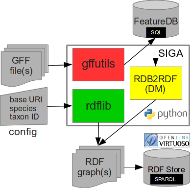

[candYgene](http://software.esciencecenter.nl/project/candygene/)
=
*SIGA.py* is a command-line tool to generate *Semantically Interoperable Genome Annotations* from
[GFF](https://github.com/The-Sequence-Ontology/Specifications/blob/master/gff3.md) files according to the Resource Description Framework ([RDF](https://www.w3.org/TR/rdf11-concepts/)) specification.

Its current pipeline is as follows
<p align="center">
  
</p>

**Key features**
- process multiple input files in GFF (versions 2 and 3)
- genome annotations (features) stored in [SQLite](https://sqlite.org/) database and serialized as RDF graph(s) in plain text formats:
  - [XML](https://www.w3.org/TR/rdf-syntax-grammar/)
  - [N-Triples](https://www.w3.org/TR/n-triples/)
  - [Turtle](https://www.w3.org/TeamSubmission/turtle/)
  - [Notation3](https://www.w3.org/DesignIssues/Notation3.html) (N3)
- supported feature (keys) types: *genome, chromosome, gene, prim_transcript, mRNA, CDS, exon, intron, five_prime_UTR, three_prime_UTR, polyA_site, polyA_sequence*
- supported feature relations ([SO(FA)](http://www.sequenceontology.org/) properties): _has_part_ and its inverse _part_of_, _transcribed_to_, _genome_of_
- sequence feature locations described by [FALDO](https://github.com/JervenBolleman/FALDO)
- parent-child feature relationships checked for referential integrity

**Installation**

`virtualenv sigaenv`

`source sigaenv/bin/activate`

`pip install -r requirements.txt`

**Example data**

`cd examples`

or download the latest genome annotations for tomato (ITAG v2.4) or potato (PGSC v4.03)

`wget ftp://ftp.solgenomics.net/genomes/Solanum_lycopersicum/annotation/ITAG2.4_release/ITAG2.4_gene_models.gff3`

`wget http://solanaceae.plantbiology.msu.edu/data/PGSC_DM_V403_genes.gff.zip`

**Example usage**

`cd src`

Generate RDF triples in Turtle format (default) from a GFF file in two steps.

GFF to DB: `python SIGA.py db -rV ITAG2.4_gene_models.gff3`

DB to RDF:
<pre><code>
python SIGA.py rdf \
-b https://solgenomics.net/ \
-c http://orcid.org/0000-0003-1711-7961 \
-s ftp://ftp.solgenomics.net/genomes/Solanum_lycopersicum/annotation/ITAG2.4_release/ITAG2.4_gene_models.gff3 \
-n "Solanum lycopersicum" \
-t 4081 ITAG2.4_gene_models.db
</code></pre>

or with a _config.ini_ file

`python SIGA.py rdf -C config.ini ITAG2.4_gene_models.db`

Summary of I/O files:

`ITAG2.4_gene_models.gff3` # GFF file

`ITAG2.4_gene_models.db`   # SQLite database

`ITAG2.4_gene_models.ttl`  # RDF file in Turtle

**Import RDF graph into Virtuoso**

See the [documentation](http://virtuoso.openlinksw.com/dataspace/doc/dav/wiki/Main/VirtBulkRDFLoader) on bulk data loading.

Edit _virtuoso.ini_ config file by adding _/mydatadir/_ to _DirsAllowed_.

Connect to db server:
`isql 1111 dba`

Delete (old) RDF graph if necessary:
`SPARQL CLEAR GRAPH <https://solgenomics.net#>;`

Delete any previously registered data files:
`DELETE FROM DB.DBA.load_list;`

Register data file(s):
`ld_dir('/mydatadir/', 'ITAG2.4_gene_models.ttl', 'https://solgenomics.net#');`

List registered data file(s):
`SELECT * FROM DB.DBA.load_list;`

Bulk data loading:
`rdf_loader_run();`

Re-index triples for full-text search:
`DB.DBA.VT_INC_INDEX_DB_DBA_RDF_OBJ();`

Note: For loading a single data file one could use the following command:

`SPARQL LOAD "file:///mydatadir/features.ttl" INTO "https://solgenomics.net#";`

However, this approach results in additional triples (generated by Virtuoso) which are not present in the input file.

Count imported triples:
`SPARQL SELECT COUNT(*) FROM <https://solgenomics.net#> { ?s ?p ?o };`

**Persist triples in Berkeley DB and then serialize RDF from DB using [Redland](http://librdf.org/) RDF processor**

```
rdfproc ITAG2.4_gene_models parse ITAG2.4_gene_models.ttl turtle
rdfproc tomato_QTLs serialize turtle
```

## Licence ##
The software is released under Apache License 2.0 licence.
